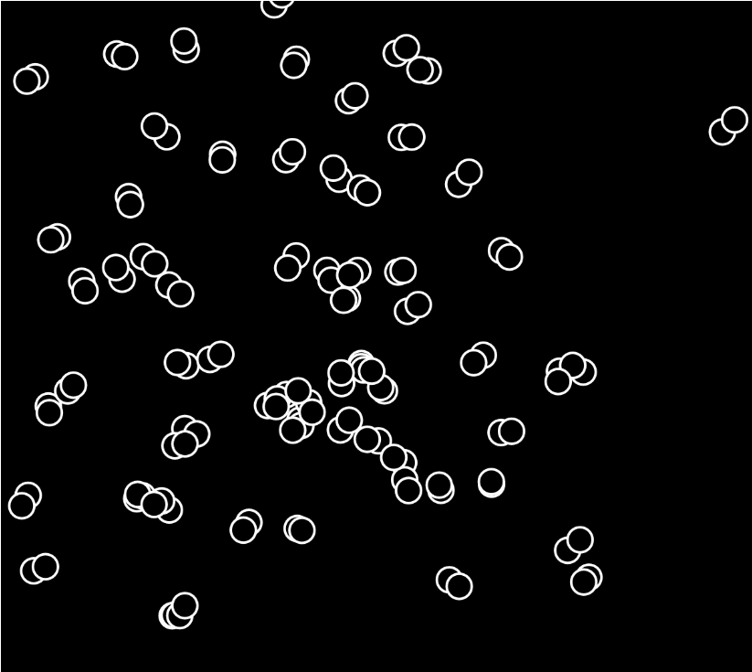
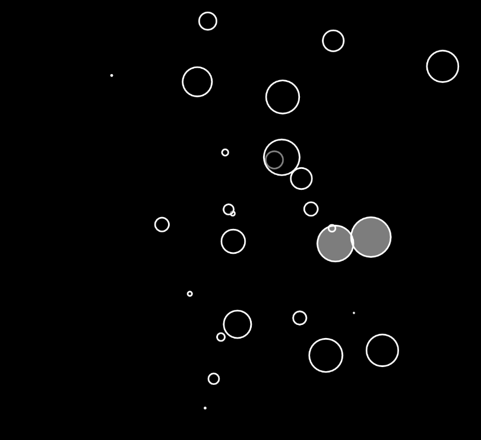

# Basic-p5-art
A basic bubble art using p5.js library

Interactive demo for Bubbles available at https://abhinavtembulkar.github.io/Basic-p5-art/Bubbles/
Interactive demo for complexBubbles available at https://abhinavtembulkar.github.io/Basic-p5-art/complexBubbles/

Instructions for Bubbles : Drag the mouse while keeping mouse pressed to draw bubbles on screen

Instructions for moreBubbles : Tap the mouse on the canvas to draw bubbles on screen

## Bubbles screenshots

## complexBubbles screenshots

